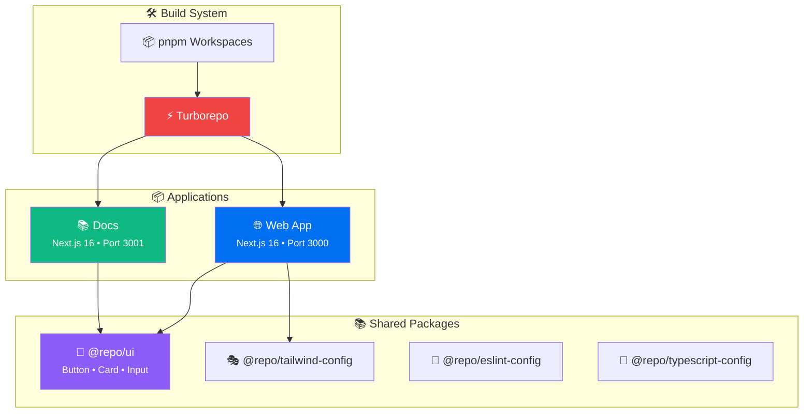

<p align="center">
  
  
  
  
  
  
</p>

<h1 align="center">🚀 surfaceX</h1>

<p align="center">
  <strong>A modern, production-ready monorepo built for scalable web applications</strong>
</p>

<p align="center">
  <a href="https://github.com/Evolphin-Software/surfaceX/actions/workflows/ci.yml"></a>
  
  
  
</p>

<p align="center">
  <a href="https://github.com/Evolphin-Software/surfaceX/wiki">📚 Documentation</a> •
  <a href="https://github.com/Evolphin-Software/surfaceX/wiki/Getting-Started">🚀 Getting Started</a> •
  <a href="https://github.com/Evolphin-Software/surfaceX/wiki/Contributing">🤝 Contributing</a>
</p>

---

## ✨ Features

| Feature                      | Description                                                           |
| ---------------------------- | --------------------------------------------------------------------- |
| 🏗️ **Monorepo Architecture** | Powered by Turborepo for blazing-fast builds with intelligent caching |
| ⚡ **Latest Stack**          | Next.js 16, React 19, TypeScript 5.9                                  |
| 🎨 **Modern UI**             | shadcn/ui components built on Radix UI + Tailwind CSS                 |
| 🧪 **Testing Ready**         | Vitest + React Testing Library configured out of the box              |
| 🔄 **State Management**      | TanStack Query (server) + Zustand (client)                            |
| 📝 **Form Handling**         | React Hook Form + Zod validation                                      |
| 🔒 **Code Quality**          | ESLint, Prettier, Husky, Commitlint                                   |
| 🚀 **CI/CD**                 | GitHub Actions workflow ready to deploy                               |

---

## 🏛️ Architecture



---

## 🚀 Tech Stack

| Category            | Technology                                                                            |
| ------------------- | ------------------------------------------------------------------------------------- |
| **Monorepo**        | [Turborepo](https://turbo.build/)                                                     |
| **Package Manager** | [pnpm](https://pnpm.io/) 9.x                                                          |
| **Frontend**        | [Next.js](https://nextjs.org/) 16 + [React](https://react.dev/) 19                    |
| **Language**        | [TypeScript](https://www.typescriptlang.org/) 5.9                                     |
| **Styling**         | [Tailwind CSS](https://tailwindcss.com/)                                              |
| **UI Components**   | [shadcn/ui](https://ui.shadcn.com/) (Radix UI)                                        |
| **State (Server)**  | [TanStack Query](https://tanstack.com/query)                                          |
| **State (Client)**  | [Zustand](https://zustand-demo.pmnd.rs/)                                              |
| **Forms**           | [React Hook Form](https://react-hook-form.com/) + [Zod](https://zod.dev/)             |
| **Testing**         | [Vitest](https://vitest.dev/) + [React Testing Library](https://testing-library.com/) |
| **Linting**         | [ESLint](https://eslint.org/) + [Prettier](https://prettier.io/)                      |
| **Git Hooks**       | [Husky](https://typicode.github.io/husky/) + [Commitlint](https://commitlint.js.org/) |
| **CI/CD**           | [GitHub Actions](https://github.com/features/actions)                                 |

---

## 📁 Project Structure

```
surfaceX/
├── 📁 apps/
│   ├── 🌐 web/                  # Main Next.js application
│   │   ├── app/                 # App Router pages
│   │   ├── components/          # App-specific components
│   │   ├── lib/                 # Utilities
│   │   └── __tests__/           # Tests
│   └── 📚 docs/                 # Documentation site
├── 📁 packages/
│   ├── 🎨 ui/                   # Shared UI components (shadcn/ui)
│   ├── 🎭 config-tailwind/      # Shared Tailwind configuration
│   ├── 📏 eslint-config/        # Shared ESLint configuration
│   └── 📘 typescript-config/    # Shared TypeScript configuration
├── 📄 turbo.json                # Turborepo configuration
├── 📄 pnpm-workspace.yaml       # Workspace definition
└── 📄 package.json              # Root package
```

---

## 🛠️ Getting Started

### Prerequisites

- **Node.js** ≥ 20
- **pnpm** ≥ 9

### Installation

```bash
# Clone the repository
git clone https://github.com/Evolphin-Software/surfaceX.git
cd surfaceX

# Install dependencies
pnpm install
```

### Development

```bash
# Start all apps in development mode
pnpm dev

# Start only the web app
pnpm dev --filter web
```

🌐 **Web App**: [http://localhost:3000](http://localhost:3000)
📚 **Docs**: [http://localhost:3001](http://localhost:3001)

### Build

```bash
# Build all apps and packages
pnpm build
```

---

## 📦 Available Scripts

| Script               | Description                    |
| -------------------- | ------------------------------ |
| `pnpm dev`           | 🚀 Start development servers   |
| `pnpm build`         | 📦 Build all apps and packages |
| `pnpm lint`          | 🔍 Run ESLint                  |
| `pnpm lint:fix`      | 🔧 Fix lint issues             |
| `pnpm format`        | 💅 Format code with Prettier   |
| `pnpm format:check`  | ✅ Check formatting            |
| `pnpm test`          | 🧪 Run tests                   |
| `pnpm test:watch`    | 👀 Run tests in watch mode     |
| `pnpm test:coverage` | 📊 Generate coverage report    |
| `pnpm check-types`   | 📝 Type check all packages     |
| `pnpm clean`         | 🧹 Clean build artifacts       |

---

## 🎨 UI Components

Import components from the shared UI package:

```tsx
import {
  Button,
  Card,
  CardHeader,
  CardTitle,
  CardContent,
  Input,
} from "@repo/ui";

export default function Example() {
  return (
    <Card className="w-96">
      <CardHeader>
        <CardTitle>Welcome! 👋</CardTitle>
      </CardHeader>
      <CardContent className="space-y-4">
        <Input placeholder="Enter your name" />
        <Button>Get Started</Button>
      </CardContent>
    </Card>
  );
}
```

See the [Components documentation](https://github.com/Evolphin-Software/surfaceX/wiki/Components) for more details.

---

## 📝 Commit Convention

This project uses [Conventional Commits](https://www.conventionalcommits.org/):

| Type       | Description         |
| ---------- | ------------------- |
| `feat`     | ✨ New feature      |
| `fix`      | 🐛 Bug fix          |
| `docs`     | 📝 Documentation    |
| `style`    | 💄 Formatting       |
| `refactor` | ♻️ Code restructure |
| `test`     | ✅ Tests            |
| `chore`    | 🔧 Maintenance      |

```bash
git commit -m "feat(ui): add new Checkbox component"
```

---

## 🚀 Deployment

### Vercel (Recommended)

1. Push to GitHub
2. Import project to [Vercel](https://vercel.com)
3. Set root directory to `apps/web`
4. Deploy! 🎉

### Enable Remote Caching

```bash
npx turbo login
npx turbo link
```

---

## 📚 Documentation

Visit our [Wiki](https://github.com/Evolphin-Software/surfaceX/wiki) for comprehensive documentation:

| Page                                                                                         | Description            |
| -------------------------------------------------------------------------------------------- | ---------------------- |
| [🏠 Home](https://github.com/Evolphin-Software/surfaceX/wiki)                                | Overview & quick start |
| [🚀 Getting Started](https://github.com/Evolphin-Software/surfaceX/wiki/Getting-Started)     | Installation guide     |
| [🏛️ Architecture](https://github.com/Evolphin-Software/surfaceX/wiki/Architecture)           | Project structure      |
| [🎨 Components](https://github.com/Evolphin-Software/surfaceX/wiki/Components)               | UI library reference   |
| [🛠️ Development Guide](https://github.com/Evolphin-Software/surfaceX/wiki/Development-Guide) | Best practices         |
| [🤝 Contributing](https://github.com/Evolphin-Software/surfaceX/wiki/Contributing)           | Contribution guide     |
| [📡 API Reference](https://github.com/Evolphin-Software/surfaceX/wiki/API-Reference)         | API documentation      |

---

## 🤝 Contributing

Contributions are welcome! Please read our [Contributing Guide](https://github.com/Evolphin-Software/surfaceX/wiki/Contributing) before submitting a Pull Request.

---

## 📄 License

This project is licensed under the **MIT License** - see the [LICENSE](LICENSE) file for details.

---

<p align="center">
  Made with ❤️ by <strong>Evolphin Software</strong>
</p>
